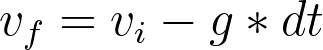
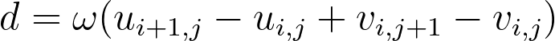
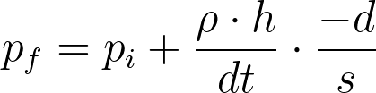
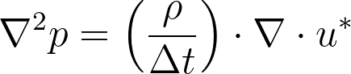
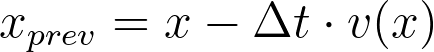
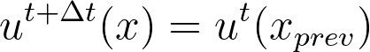

# Fluid Simulation

A 2D fluid simulation built with C++ and SFML, showing smoke visualization overlaid on a pressure field rendering.

# Preview


## Reqs

- **C++17** compatible compiler (GCC or Clang)
- **SFML 3.x** (graphics, window, and system components)
- **Make** or **CMake** for building

## Usage

### Running the Simulation
```bash
# build separately and run
make
./FluidSim
```


### Simulation Parameters

The simulation uses these default parameters:
- **Grid size**: 100x100 cells
- **Gravity**: 9.81 m/s²
- **Density**: 1.0 kg/m³
- **Successive Over-Relaxation (SOR)**: 1.9 (for faster convergence)
- **Time step**: 1/60 second (per frame)
- **Iterations**: 20 pressure solver iterations per frame (for Gauss-Seidel)


## Technical Details

### Fluid Simulation Algorithm

The simulation implements a basic Eulerian fluid simulator. 

Assumptions
- The fluid is inviscid.
- The fluid is incompressible.

A staggered grid is applied to store horizontal (u) and vertical (v) velocity components. 

The process is as follows:

1. **Applying gravity condition** across all vertical components across a defined ```dt```.

   

2. **Projection for incompressibility** (systems are solved via Gauss-Seidel method with SOR acceleration).

   Here, outward flux is described as positive.

   

   To achieve incompressibiliy for each cell ($div=0$), the net divergence is equally in all non-boundary directions.

   The pressure projection is also calculated via

   

   to approximate the Poisson equation for pressure (time-discrete form)

   

3. **Advection** (using semi-Lagrangian advection)
   Backtrace from the current face position (vector x represents any vector u or v)

   

   Bilinearly interpolate from the old field and transfer velocity component

   


   Smoke advection is utilized for visualization; the calculation is essentially the same as the velocity advection process.


## Acknowledgments

 Inspired by [Matthias Müller's 10-Minute Physics: Fluid Simulation](https://matthias-research.github.io/pages/tenMinutePhysics/17-fluidSim.pdf)
